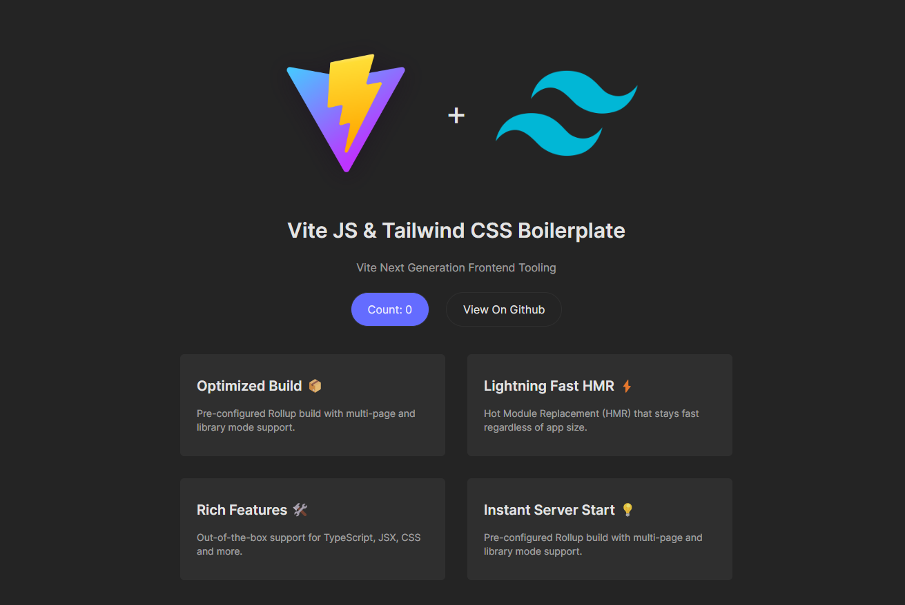

# Vite Js and Tailwind CSS Boilerplate



### Used Library

- `vite`
- `tailwindcss`
- `postcss`
- `autoprefixer`

# Clone the repo to local

```sh
# git clone this repository 🦑
git clone https://github.com/sadman-shami/vite-tailwind-boilerplate.git
cd vite-tailwind-boilerplate

# install dependencies 🧶

# npm
npm i

# yarn
yarn

# pnpm
pnmp
```

# Checklist

When you use this template, update the followings:

- [ ] Remove `.git` directory and run `git init` to clean the commit history.
- [ ] Cleanup `README.md` file.
- [ ] Delete `screen.png` file.

**Now you can enjoy 😁**

# Usage

The starter contains the following scripts:

### Yarn

- `yarn dev` - start a vite dev server 🚀
- `yarn build` - build the project 📦
- `yarn preview` - preview build 🎉

### Pnpm

- `pnpm dev` - start a vite dev server 🚀
- `pnpm build` - build the project 📦
- `pnpm preview` - preview build 🎉

### Npm

- `npm run dev` - start a vite dev server 🚀
- `npm run build` - build the project 📦
- `npm run preview` - preview build 🎉

# Acknowledgement

If you found it useful somehow, I would be grateful if you could leave a star in the project's GitHub repository.

Thank you 😊.
